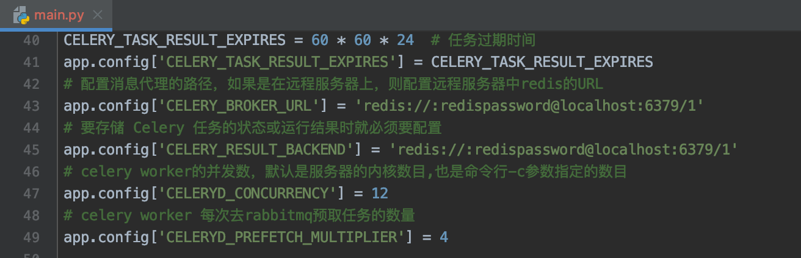

# OnlineTrainingAndValid
For online training DL or ML project(not only tensorflow pytroch project)  Online!  And make dataset(etc. image or other sequence file) online. Check server status realtime. Multiply training task thread running.   

在线进行多任务训练(不止tensorflow pytorch等)，在线批量上传数据(图片等)生成数据集，在线管理。实时监测服务器状态，如内存、CPU信息。在线验证训练效果。
<small>
> 欢迎查看我的其他项目：
>
> >  基于深度学习手写文本行图片识别tensorflow: https://github.com/holny/Image_Recognizer
>
> > 图像增强和针对手写图像真实化工具: https://github.com/holny/Data_GneratorAugmentation
</small>
### Show ##

### Useage ###

1. pip install   follow necsssary module ,  flask 0.12, celery 4.4.5, numpy, shutil  and other module,check xxx.py import.

   主要需要如下module flask, celery, numpy, shutil。还有一些其他模块。

2. Prepare redis and mysql, redis config in main.py , mysql config in main.py and your task  xxx.py.  

​	redis as Celery broker,  mysql for manage data and running info.

​	请先准备好redis和Mysql，redis配置在main.py。Mysql配置在main.py和你任务代码文件。如何配置如下。

	

3. Specify you task: 1.copy your task xxx.py file into the root of OnlineTrainingAndValidate project dir. (at the moment, Online project don't support upload task file online for specify task, but you can develop this function base on my code) 2. Config your task running api method in main.py simple_train().  3. add some mysql tool code into your task file code, for record training  info into mysql. And don't forget add a 'self' param into your task running api method params list (celery need for update your task thread status, and we can get it on main thread).

   You can read and follow 2 case: task.py  or main_task.py.

   ​	开始指定要在线训练的任务: 1. 把你需要跑的训练代码文件复制到OnlineTrainingAndValidate项目目录下，与main.py同目录(目前还不支持在线上传代码文件，不过你可以在我的基础上实现这个功能)。2. 配置你任务的running api方法在main.py的simple_train()方法(需要运行你指定的方法才能开始训练)。3. 在你的任务代码文件里添加一些mysql方法，用于实时记录当前训练信息到Mysql。并且别忘了要给你前面提供的running api方法多加一个'self'参数在你的参数列表里，因为celery需要记录你任务线程运行信息，我们好在其它主线程里获取到信息。

   ​	你也可以参照已有的2个样例: task.py或者main_task.py

   

4. Final,  run the flask(main.py) with celery(  $ celery worker -A main.celery --loglevel=info  , run celery broker  in terminal  base the root path of project).  Start your multiply tasks online, and your can check these tasks status online or  terminal.

   ​	最终，运行flask程序main.py ，别忘了也要运行celery broker, 在项目根目录下的终端输入命令:  celery worker -A main.celery --loglevel=info, 命令中已经指定好了main和celery(因为celery在main.py中声明为celery的)。 然后在线开始你的任务训练，你可以在线监测任务状态，也可以在终端的celery broker检查。

   

